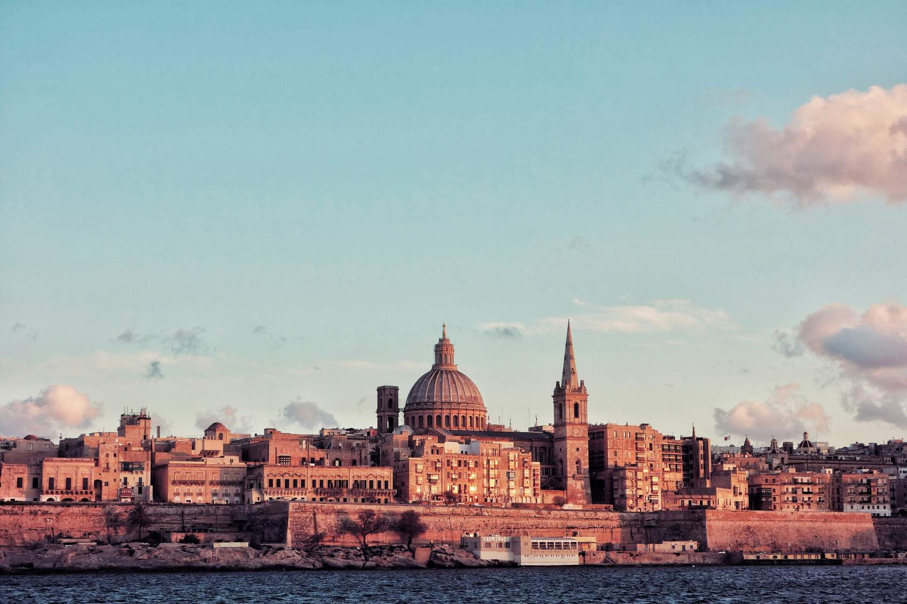
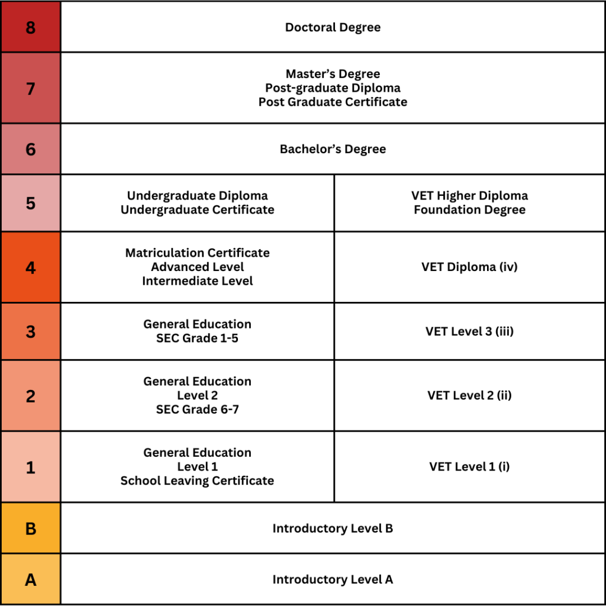
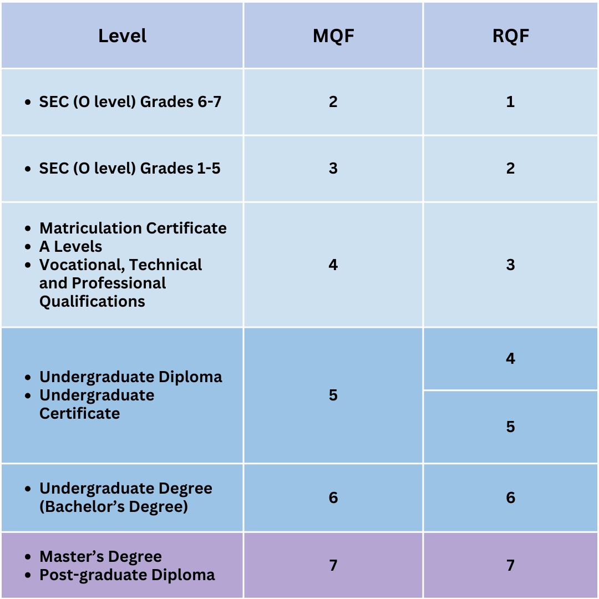

# Malta as Study Destination

Malta’s
Qualifications Framework.

How does it convert

## Availabel Universities

### IDEA Academy - Mosta, Malta
Application Process

- Step 1: Submit Application form along with the documents.
- Step 2: pay application fee of 100 euro (non-refundable)
- Step 3: Get Offer letter & invoice
- Step 4: Apply for NOC
- Step 5: pay 250 euro for LOA (latter of acceptance) - (non-refundable)
- Step 6: Pay 150 euro for visa (non-refundable)
- Step 7: Submit the documents at VFS. VFS will courier the documents to immigration department Malta. VFS charge approx. 22,000 INR (non-refundable)
- Step 8: The immigration department will provide the visa and passport will be returned through VFS.
- Step 9: Pay tuition Fees

After Graduation

> Students will receive the EU Certificate which opens their gateway to 28 different EU member countries. After graduation, the students can get six months of layover visa during which they can find job and stay in Malta with a work permit and temporary residence permit (TRP) If the student works in Malta for at least 2 years, they can become eligible for 70% tuition fee refund by the Malta government. This applies to any nationality.idea academy will support for plcement after graduation to all the students.

> Note: The student who have less then 2.50 gpa and academic gap more than three years can apply for idea academy dubai campus.after first year of education student can take credit transfre to malta main campus for further study. 
> 
> Course fee for first year of education – 4100 USD
> 
> Visa fee - 1200 USD
> 
> 100% credit transfer possible

Here's a well-structured and beautifully formatted version of your information using **Markdown**:

---

## ✨

### 🎓 **Courses Available**

* **Bachelor Programs**:

  * BBA (Bachelor of Business Administration)
  * BHM (Bachelor of Hospitality Management)
  * BIT (Bachelor of Information Technology)
  * Master in Global Business

### 📚 **Bachelor’s Program Details**

* **Duration**: 3 Years
* **Part-Time Job**: 20 hours/week legally allowed
  *💼 Idea Academy provides support for finding part-time jobs.*
* **Intakes**: June/July, October, February
* **Tuition Fees (Approx. €14,500 for 3 Years)**:

  * **1st Year**: €7,000 *(Payable after visa grant)*
  * **2nd Year**: €3,750
  * **3rd Year**: €3,750

### 🎓 **Master’s Program Details**

* **Duration**: 24 Months
* **Intakes**: June/July, October, February
* **Tuition Fees**: Approx. **€8,500** (Full course)

### 📋 **Admission Requirements**

* **IELTS/PTE**: Not mandatory
* **Alternative**: Letter from previous college stating the medium of instruction was English

### 🛂 **Visa Requirements (Malta VES Details)**

* Submit **6 months' bank statement**
* Must show a **minimum balance of €12,000**
  *(Approx. NPR 18 Lakhs) in the account for **1 day***

---

# Malta Highlights

- Malta offers high-quality education at affordable rates in the heart of Mediterranean Sea. Known for its history and vibrant lifestyles. 
- Key highlights:
  - English-speaking  environemnt
  - Hot, dry summers and mild, wet winters

### Working in Malta and Post study options

- allowed to work part time (up to 20 hours per week) after the first three months of their study period.
- Post study work visa up to one year after graduation.

#### Eligibility criteria
- Must completed a full-time course (recognised by the National Commission for Further and Higher Education (NCFHE))

- Health Insurance
- Applly for this visa before your student visa expires.
- 

#### Pathway to permanent residency

- Highest employment rate withn the European Union (95.8%)

---

# References

[Idea academy](https://www.standyou.com/study-abroad/idea-academy-malta-campus-malta-1/)

